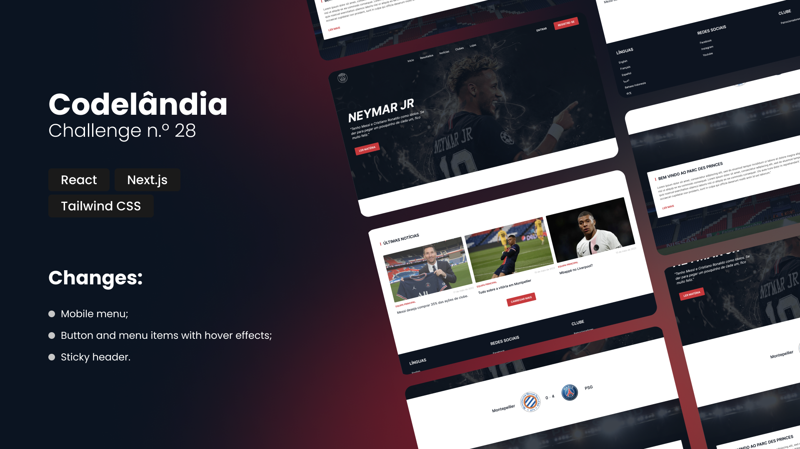

<h1 style='font-weight: 300'><strong>Codelândia</strong> - Challenge n.º 28</h1>

This repository contains the challenge number 28 from <a href='https://discord.com/invite/wNCWTVuxyz' target='_blank'><strong>CodeLândia</strong></a> community.

On the link above you can found all the challenges available at the moment, containing the link to <strong>Figma</strong> and for the assets you need.

## 🛠 Skills

![react][react] ![next][next] ![tailwind][tailwind] ![comintlint][commitlint] ![prettier][prettier]

## 📄 Roadmap

I pick this challenge on the **[CodeLândia](https://discord.com/invite/wNCWTVuxyz)** community focused on improve my skills on **Tailwind CSS**, creating a cool landing page following the **Figma** design.
The next goals for this challenge is improve **SEO** like a really landing pages need:

-   set page title;
-   set favicon;
-   set website description;
-   etc.

### What is missing?

-   [x] ~~**ESLint** configuration;~~
-   [ ] Improve SEO;
-   [ ] Add scroll animations;
-   [ ] Add **Docker** files to run this project with **Docker** in `dev` and `production` mode.

## 🔗 More About Me

[react]: https://img.shields.io/badge/react-1E4174?style=for-the-badge&logo=react&logoColor=white
[next]: https://img.shields.io/badge/Next.js-1E4174?style=for-the-badge&logo=next.js&logoColor=white
[tailwind]: https://img.shields.io/badge/tailwindcss-1E4174?style=for-the-badge&logo=tailwindcss&logoColor=white
[commitlint]: https://img.shields.io/badge/commitlint-1E4174?style=for-the-badge&logo=commitlint&logoColor=white
[prettier]: https://img.shields.io/badge/prettier-1E4174?style=for-the-badge&logo=prettier&logoColor=white
[youtube]: https://img.shields.io/badge/youtube-red?style=for-the-badge&logo=youtube&logoColor=white
